# Task 2: Create database and table in your MySQL server

#### 1. Create a new database named website .
```sql
CREATE DATABASE website;
USE website;
```
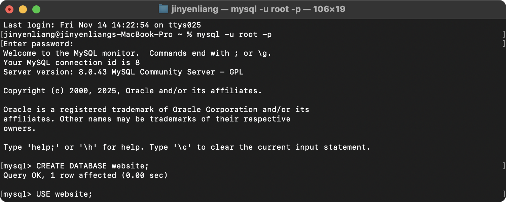

#### 2.Create a new table named member , in the website database, designed as below:
```sql
CREATE TABLE member (
    id INT UNSIGNED PRIMARY KEY AUTO_INCREMENT,
    name VARCHAR(255) NOT NULL,
    email VARCHAR(255) NOT NULL,
    password VARCHAR(255) NOT NULL,
    follower_count INT UNSIGNED NOT NULL DEFAULT 0,
    time DATETIME NOT NULL DEFAULT CURRENT_TIMESTAMP
);
```
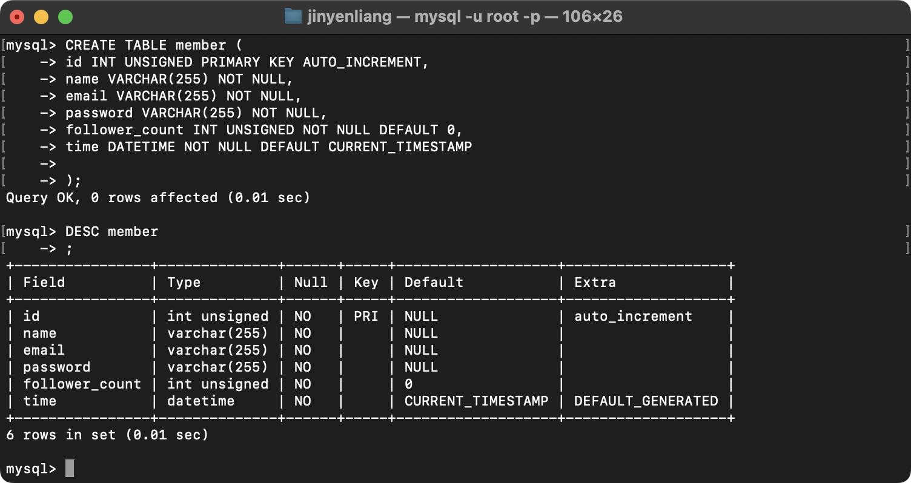
#
---
#
# Task 3: SQL CRUD

#### 1.INSERT a new row to the member table where name, email and password must be set to test , test@test.com , and test . INSERT additional 4 rows with arbitrary data.
```sql
INSERT INTO member (name, email, password) VALUES ('test', 'test@test.com', 'test');
INSERT INTO member (name, email, password) VALUES 
('apple', 'apple@apple.com', 'apple'),
('banana', 'banana@banana.com', 'banana'),
('cat', 'cat@cat.com', 'cat'),
('dog', 'dog@dog.com', 'dog');
```
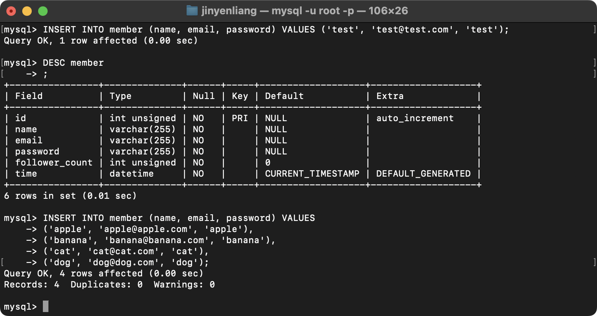

#### 2.SELECT all rows from the member table.

```sql
SELECT * FROM member;
```
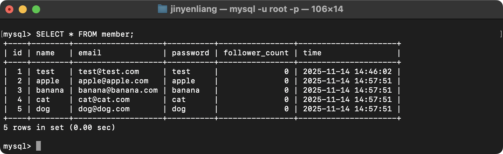

#### 3.SELECT all rows from the member table, in descending order of time.

```sql
SELECT * FROM member ORDER BY time DESC;
```
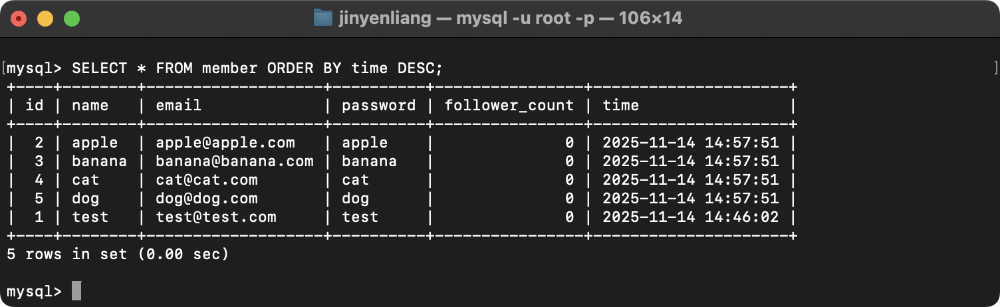

#### 4.SELECT total 3 rows, second to fourth, from the member table, in descending order of time.

```sql
SELECT * FROM member ORDER BY time DESC LIMIT 3 OFFSET 1;
```
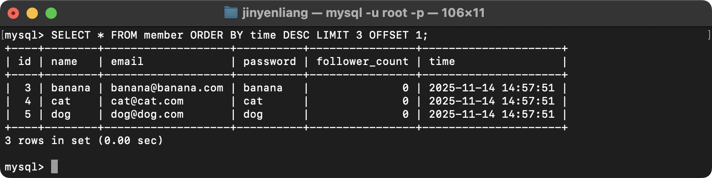

#### 5.SELECT rows where email equals to test@test.com .
```sql
SELECT * FROM member WHERE email = 'test@test.com';
```
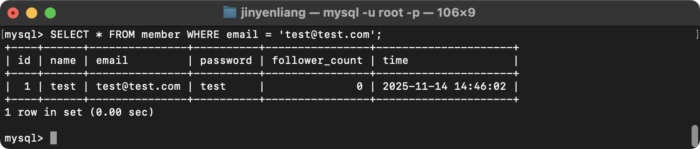

#### 6.SELECT rows where name includes the es keyword.
```sql
SELECT * FROM member WHERE name LIKE '%es%';
```
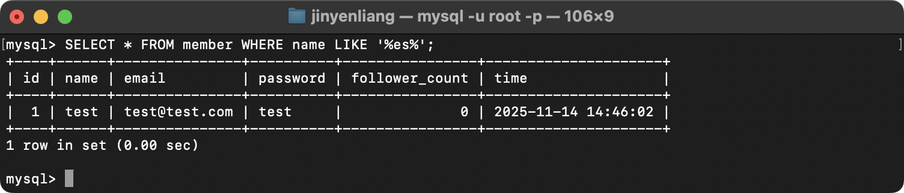

7.SELECT rows where email equals to test@test.com and password equals to test.
```sql
SELECT * FROM member WHERE email = 'test@test.com' AND password = 'test';
```
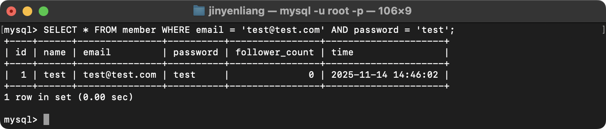

8.UPDATE data in name column to test2 where email equals to test@test.com.
```sql
UPDATE member SET name = 'test2' WHERE email = 'test@test.com';
```
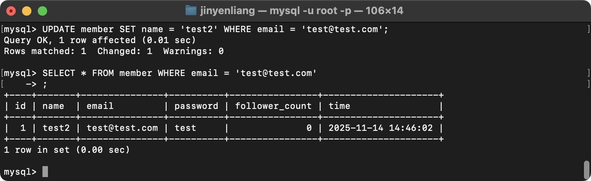
#
---
#
# Task 4: SQL Aggregation Functions
#
#### 1.SELECT how many rows from the member table.
```sql
SELECT COUNT(*) FROM member;
```
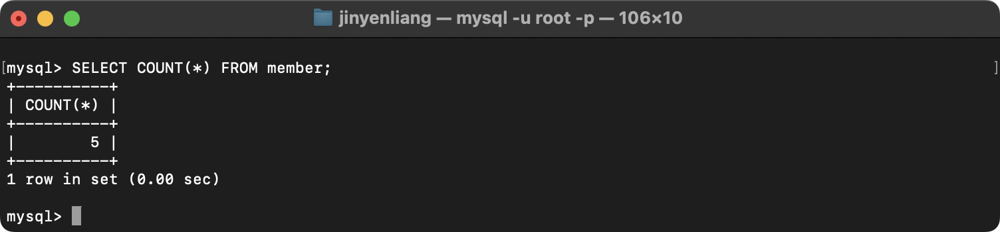

#### 2.SELECT the sum of follower_count of all the rows from the member table.
```sql
SELECT SUM(follower_count) FROM member;
```
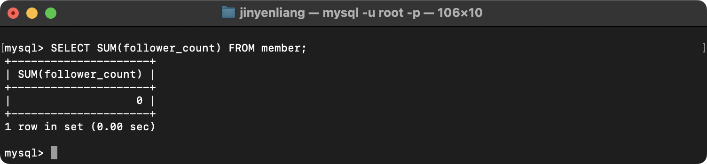

#### 3.SELECT the average of follower_count of all the rows from the member table.
```sql
SELECT AVG(follower_count) FROM member;
```
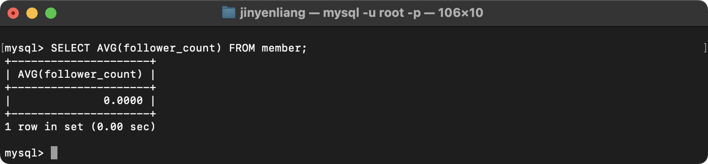

#### 4.SELECT the average of follower_count of the first 2 rows, in descending order of follower_count, from the member table.
```sql
SELECT AVG(first2.follower_count)
FROM (SELECT follower_count FROM member ORDER BY follower_count DESC LIMIT 2) AS first2;
```
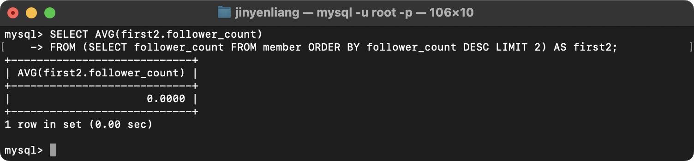
#
---
#
# Task 5: SQL JOIN
#
#### 1.Create a new table named message , in the website database
```sql
CREATE TABLE message (
    id INT UNSIGNED PRIMARY KEY AUTO_INCREMENT,
    member_id INT UNSIGNED NOT NULL,
    -- content VARCHAR(65535) NOT NULL,
    -- 輸入65535會出現「ERROR 1074 (42000): Column length too big for column 'content' (max = 16383); use BLOB or TEXT instead」
    content TEXT NOT NULL,
    like_count INT UNSIGNED NOT NULL DEFAULT 0,
    time DATETIME NOT NULL DEFAULT CURRENT_TIMESTAMP,
    FOREIGN KEY (member_id) REFERENCES member(id)
);
```
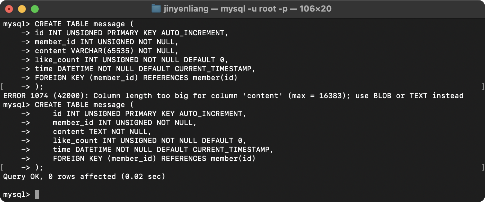

#### 2.SELECT all messages, including sender names. We have to JOIN the member table to get that.
```sql
SELECT message.content, member.name
FROM message
JOIN member ON message.member_id = member.id;
```
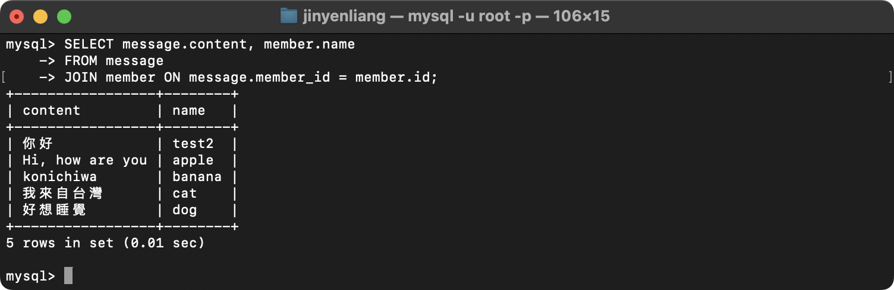

#### 3.SELECT all messages, including sender names, where sender email equals to test@test.com . We have to JOIN the member table to filter and get that.
```sql
SELECT message.content, member.name
FROM message
JOIN member ON message.member_id = member.id
WHERE member.email = 'test@test.com';
```
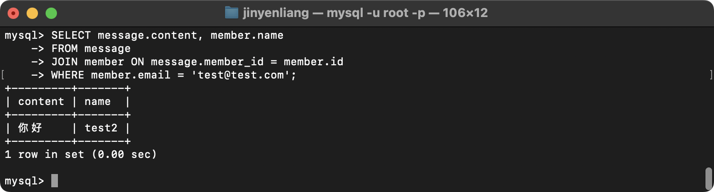

#### 4.Use SELECT, SQL Aggregation Functions with JOIN statement, get the average like count of messages where sender email equals to test@test.com .
```sql
SELECT AVG(message.like_count)
FROM message
JOIN member ON message.member_id = member.id
WHERE member.email = 'test@test.com';
```
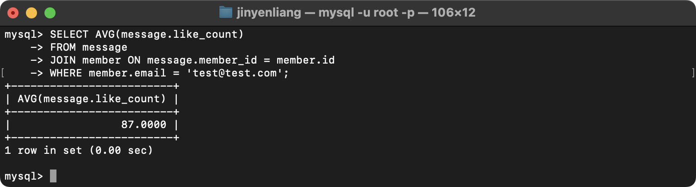

#### 5.Use SELECT, SQL Aggregation Functions with JOIN statement, get the average like count of messages GROUP BY sender email.
```sql
SELECT member.name, member.email, AVG(message.like_count)
FROM message
JOIN member ON message.member_id = member.id
GROUP BY member.email, member.name;
```
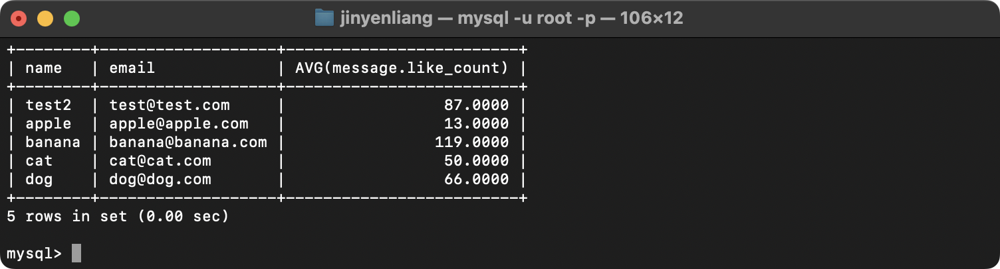